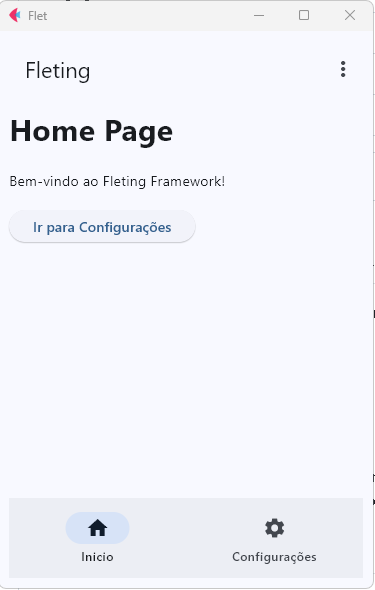

# ⚡ Fleting Framework



Fleting é um micro-framework opinativo construído sobre **Flet**, focado em:
- simplicidade
- organização clara
- produtividade
- aplicações multiplataforma (mobile, tablet e desktop)

Ele traz uma arquitetura inspirada em MVC, com **layout desacoplado**, **roteamento simples**, **i18n**, **responsividade automática** e um **CLI para geração de código**.

## 🚀 Quick Start

### 1. crie um ambiente virtual isolado

- [env com poetry](docs/enviroment.md)

```bash
python app.py
```

## 🛠️ CLI

```shell
fleting create page home
```

## 📚 Documentação

A documentação completa está disponível em:

👉 [documentação completa](docs/index.md)

---

## 🎯 Filosofia

O Fleting foi criado com alguns princípios claros:

### 1️⃣ Simplicidade acima de tudo
- Nada de abstrações desnecessárias
- Código explícito e fácil de entender
- Arquitetura previsível

### 2️⃣ Separação de responsabilidades
- **View** → UI pura (Flet)
- **Layout** → Estrutura visual reutilizável
- **Controller** → Regras de negócio
- **Model** → Dados
- **Router** → Navegação
- **Core** → Infraestrutura do framework

### 3️⃣ Mobile-first
- O estado global da aplicação identifica automaticamente:
  - `mobile`
  - `tablet`
  - `desktop`
- Layouts podem reagir dinamicamente ao tipo de dispositivo

### 4️⃣ Internacionalização nativa
- Sistema de tradução simples baseado em JSON
- Mudança de idioma em tempo real
- Traduções acessíveis em qualquer parte da app

### 5️⃣ CLI como cidadão de primeira classe
- Criação e remoção de arquivos padronizados
- Redução de boilerplate
- Convenção > Configuração

---

## 📄 Licença

MIT